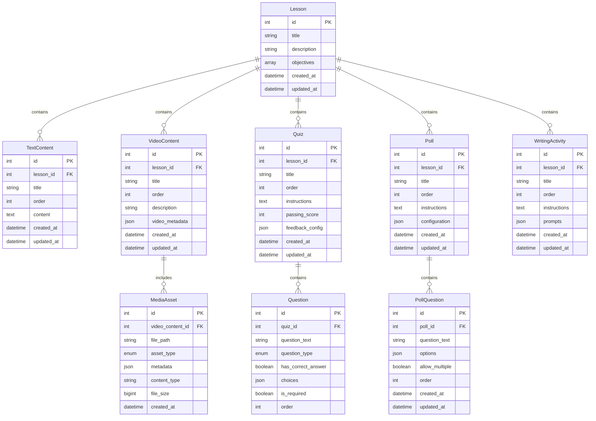

# Proposed Curriculum Content Database Structure

## Breakdown

1. Lesson

    - Top-level container for a complete lesson (like "Going to College")
    - Contains objectives and high-level metadata
    - One lesson has many sections (e.g., Text Content, Quiz, Writing, etc.)

2. TextContent
    - Basic text-based content sections within a lesson
    - Can contain formatted text, HTML, or markdown
    - Used for explanatory content, instructions, and reading materials
    - Ordered within the lesson for proper flow

3. VideoContent
    - Video-based learning materials within a lesson
    - Includes description and metadata about the video
    - Can have multiple associated media assets
    - Supports different video types and sources through metadata

4. Quiz
    - Assessment component containing multiple questions
    - Includes instructions and configurable passing score
    - Contains feedback configuration for different score ranges
    - Can track student performance and completion
    - Ordered within the lesson flow

5. Poll
    - Interactive polling component with multiple questions
    - Used for gathering student opinions or preferences
    - Can include various configuration options for display and interaction
    - Results can be shown to students or kept private
    - No "correct" answers, unlike quizzes

6. PollQuestion
    - Individual questions within a poll
    - Contains multiple choice options in JSON format
    - Can allow single or multiple selections
    - Ordered within its parent poll
    - Stores response options and configuration

7. WritingActivity
    - Free-form writing exercises or assignments
    - Contains instructions and multiple optional prompts
    - Can include helper text or example responses
    - Supports different types of writing activities through configuration
    - May include word count limits or other constraints

8. Question
    - Individual questions within a quiz
    - Supports multiple question types (multiple choice, true/false, etc.)
    - Can have correct answers for automatic grading
    - Includes required/optional status
    - Ordered within its parent quiz

9. MediaAsset
    - Stores metadata for video and other media files
    - Links directly to VideoContent
    - Contains technical information about the media
    - Supports different file types and formats
    - Includes file size and content type information

## Common Fields

All content types (TextContent, VideoContent, Quiz, Poll, WritingActivity) share these base fields:
- `id`: Primary key identifier
- `lesson_id`: Foreign key to parent lesson
- `title`: Display title of the content
- `order`: Position within the lesson
- `created_at`: Timestamp of creation
- `updated_at`: Timestamp of last update

## Relationships

1. Lesson to Content Types
    - One-to-many relationship with all content types
    - Content types are ordered within their lesson
    - Each content type can belong to only one lesson

2. Quiz and Poll to Questions
    - One-to-many relationship
    - Questions are ordered within their parent
    - Questions cannot exist without a parent

3. VideoContent to MediaAsset
    - One-to-many relationship
    - MediaAssets are specifically tied to video content
    - Handles technical metadata for video files