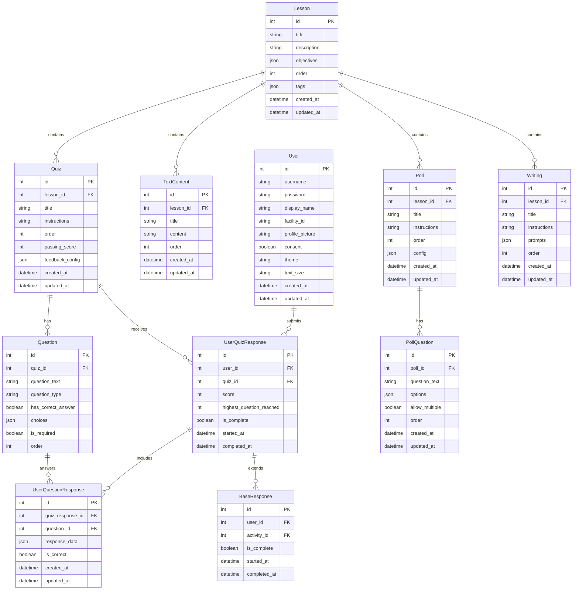

```mermaid
erDiagram
    User ||--o{ UserQuizResponse : submits
    
    Lesson ||--o{ TextContent : contains
    Lesson ||--o{ Quiz : contains
    Lesson ||--o{ Poll : contains
    Lesson ||--o{ Writing : contains
    
    Quiz ||--o{ Question : has
    Poll ||--o{ PollQuestion : has
    
    Quiz ||--o{ UserQuizResponse : receives
    UserQuizResponse ||--o{ UserQuestionResponse : includes
    Question ||--o{ UserQuestionResponse : answers

    UserQuizResponse ||--o{ BaseResponse : extends
    
    BaseResponse {
        int id PK
        int user_id FK
        int activity_id FK
        boolean is_complete
        datetime started_at
        datetime completed_at
    }

    User {
        int id PK
        string username
        string password
        string display_name
        string facility_id
        string profile_picture
        boolean consent
        string theme
        string text_size
        datetime created_at
        datetime updated_at
    }
    
    Lesson {
        int id PK
        string title
        string description
        json objectives
        int order
        json tags
        datetime created_at
        datetime updated_at
    }
    
    TextContent {
        int id PK
        int lesson_id FK
        string title
        string content
        int order
        datetime created_at
        datetime updated_at
    }
    
    Quiz {
        int id PK
        int lesson_id FK
        string title
        string instructions
        int order
        int passing_score
        json feedback_config
        datetime created_at
        datetime updated_at
    }
    
    Question {
        int id PK
        int quiz_id FK
        string question_text
        string question_type
        boolean has_correct_answer
        json choices
        boolean is_required
        int order
    }
    
    Poll {
        int id PK
        int lesson_id FK
        string title
        string instructions
        int order
        json config
        datetime created_at
        datetime updated_at
    }
    
    PollQuestion {
        int id PK
        int poll_id FK
        string question_text
        json options
        boolean allow_multiple
        int order
        datetime created_at
        datetime updated_at
    }
    
    Writing {
        int id PK
        int lesson_id FK
        string title
        string instructions
        json prompts
        int order
        datetime created_at
        datetime updated_at
    }
    
    UserQuizResponse {
        int id PK
        int user_id FK
        int quiz_id FK
        int score
        int highest_question_reached
        boolean is_complete
        datetime started_at
        datetime completed_at
    }
    
    UserQuestionResponse {
        int id PK
        int quiz_response_id FK
        int question_id FK
        json response_data
        boolean is_correct
        datetime created_at
        datetime updated_at
    }
```